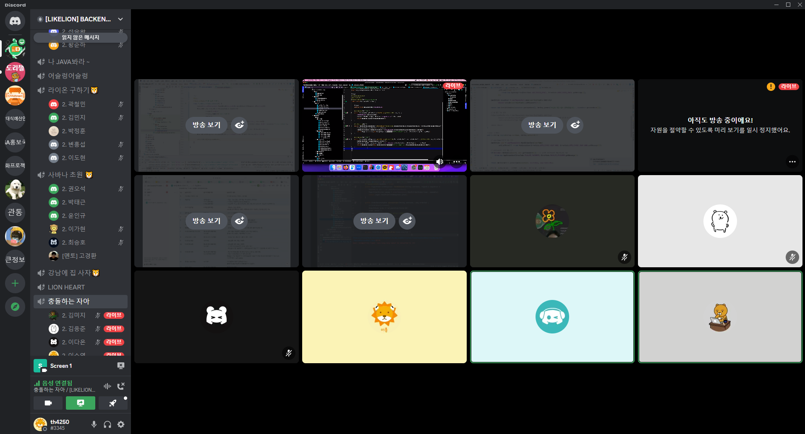

# Woowahan Recipe / 10팀 진행 상황 공유

## 👨‍👦‍👦팀 구성원, 개인 별 역할

------

### 역할 분담

- PM  : 허진혁
- CTO : 김응준
- Infra : 이소영
- 기획 : 이다온
- 개발 1 : 김미지
- 개발 2 : 이수진

### 개발 역할 분담

- 허진혁 : 스웨거, 시큐리티, 로깅 적용, 주문 관련 기능
- 김응준 : 레시피 CRUD 기능, 조회수 기능
- 이소영 : CI/CD 구축, 좋아요 누르기/ 취소, 알림 이벤트, 크롤링(도전), 판매자 등록
- 이다온 : 로그인, 회원가입, 회원 CRUD 기능
- 김미지 : 레시피에 대한 리뷰 CRUD
- 이수진 : 아이템(재료) CRUD 기능, 검색 기능

 

## 🔊팀 내부 회의 진행 회차 및 일자

------

- 1회 차(2023.01.15) Discord 회의 진행
- 2회 차(2023.01.16) Discord 회의 진행 & 문서 정리
- 3회 차(2023.01.17) Discord 회의 진행 & 개발 시작
- 4회 차(2023.01.18) Discord 회의 진행 & 개발 진행
- 5회 차(2023.01.19) Discord 회의 진행 & 개발 진행
- 6회 차(2023.01.20) Discord 회의 진행 & 코드 정리

 

## 💻현재까지 개발 과정 요약

------

- 허진혁
  - 주문 관련 로직을 구현할 때, 상품과의 연관관계, 유저와 연관관계 등 다양한 부분을 고려해야 해서 생각을 많이 했습니다.
  - 도메인에서 연관관계 메서드, 비지니스 메서드, 조회 메서드를 만들어 도메인에서 관리할 수 있다는 것을 배웠습니다.
  - 주문 관련 테스트를 할 때, 단위테스트를 해야할지 통합테스트를 해야할지를 고민하고 있습니다.
  - 시큐리티 관련 부분에서 sns회원가입을 할 경우, 보통 로그인에 필요한 id를 알 필요가 없습니다. 그래서 그에 따른 권한 인증하는 부분에 대한 고민하고 있습니다.
  - 스프링부트 3.0.x를 도입하여 진행해보았지만, 정보가 너무 적고 특히 swagger-ui 부분에서 계속 404 에러를 만나, 버전을 다시 낮추었습니다.
- 김응준
  - 썸네일과 같은 이미지 관련 부분은 난이도가 있어서 임시적으로 제외하고 레시피 기능 개발
  - 이미지 업로드 개발은 레시피페이지를 만든 이후에 구현할 계획
  - 리뷰, 재료의 리스트를 레시피페이지에 같이 띄워야되는데 이 부분에 대한 프론트 지식이 없음
  - 조회수 기능을 추가했고 지금은 한명이 같은글을 계속 조회하면 조회수가 계속 올라가는데, 쿠키를 추가해서 방지하는 기능을 생각중
  - 조회수 기능을 쿼리를 이용해서 db를 직접 +1 해주는데 쿼리를 잘 몰라서 테스트를 어떻게 진행해야 될지 모름
  - 궁금한점은 사이트에서 흔히 보는 코드에 DI 이후 OOORepository.~~~ 하면 될걸 왜 this.OOORepository.~~~ 으로 적는지
- 이소영
  - Git 협업 시 Merge 충돌이 발생하는 상황이 생각보다 많이 발생하여 이를 해결하는 데에 조금 어려웠습니다.
  - 프론트엔드 경험이 없는 팀원들이 없어 어느 부분까지 백엔드에서 구현해야 하는지 궁금해하는 팀원이 많았습니다. 이를 통해 백엔드에서도 프론트엔드 경험이 필요하다는 것을 다시한번 느끼게 되었습니다.
  - SpringBoot와 JDK 버전을 달리 적용했을 때 배포 시 Exit(1) 상태가 뜨며 컨테이너가 실행이 되지 않은 적이 있었는데 이를 통해 CI/CD 구축 과정을 다시 살펴보고 이해하는 시간을 가질 수 있었습니다.
  - 알림 이벤트 구현을 위한 학습을 통해 Observer 패턴과 EventListener에 대해 알게 되었습니다.
  - Jsoup을 이용한 만개의 레시피, 쿠팡, 이마트 등 다양한 사이트를 크롤링을 시도했을 때 텍스트는 잘 가져와졌지만 이미지를 가져오는 과정에서 SocketException 또는 Time out Error가 발생하였고 이를 해결하지 못한 부분이 아쉽습니다.
- 이다온
  - 요구사항 정의서와 Entity 정의서에 맞게 개발을 하다가도 구현하면서 필요한 컬럼을 추가하고 필요없는 컬럼은 변경하고 하는 과정에서 필요하면 추가, 수정도 가능하며 시작 전에 정의서를 탄탄하게 작성해야 하는 중요성을 깨닳았습니다.
  - 회원가입, 로그인 기능 구현(Entity, Dto, Controller, Reposirtory, Service)
  - 오류를 거쳐서 반환해주는 ExceptionHandler가 없고 SecurityConfig, Jwt 등 있는 상태에서 오류가 출력되지 않아 문제점을 찾는데 많은 시간이 소요되었습니다. 그래서 ExceptionHandler를 거치지 않고 Service단에서 오류 출력문을 작성하여 오류 파악 후 기능 구현을 완료하였으며 이후에 logging방식 수정, ExceptionManager 추가로 인해 Console, postman에서 오류 출력이 되었습니다.
  - 회원 한명의 정보 조회 기능 구현
  - 회원 삭제 구현 완료 이후 pipeline에서 에러 경고 발생 후 수정 진행
  - 회원 수정 기능 구현 중
  - 수정 기능 구현 중에 회원이 이미 삭제가 되어 deleted 번호가 1로 변경된 회원을 로그인하려고 보니 원하는 예외처리가 반환되지 않아 이 부분도 추가로 예외처리를 할 예정입니다.
- 김미지
  - 댓글 기능 CRUD를 만들었습니다. 개인 프로젝트의 Post 기능과 비슷해서 참고하여 구현 할 수 있었습니다
  - Git에서 pull하면 충돌이 일어났을 때 어떻게 해결 할 수 있는지 배울 수 있었습니다
  - 전체 조회 기능을 구현 중입니다
- 이수진
  - 깃랩에 권한 문제로 푸시가 되지 않아서 이를 해결하기 위해 하루를 소비하였고 명확한 원인은 찾지 못했지만 ssh키 로그인 방식으로 문제를 해결하였습니다.
  - 아이템(재료)의 CRUD 기능을 구현하였습니다. 개인 프로젝트에서 구현했었던 CRUD와 비슷했기 때문에 로직 구현 자체는 큰 어려움이 없었지만 다른 페이지와의 연결, 다른 엔티티와의 매핑관계를 고려하여 구현하는게 어려웠습니다.
  - 아이템(재료)의 C기능에서 사용자가 이미지를 직접 업로드하는 기능을 아직 구현하지 못했습니다. 검색을 통해서 오늘안에 해결하고 싶습니다.
  - 아이템(재료)의 검색 기능을 구현하였습니다. 현재는 검색어를 포함하는 내용이 출력되도록 로직을 작성하였는데 ‘인기순’, ‘가격순’등으로 조회하기, 카테고리 별로 조회하기 기능을 추가하고 싶습니다.

## ❓개발 과정에서 나왔던 질문

------

- 매핑 관계

  👉  주문과 아이템 매핑하기, 카트와 아이템 매핑하기, 레시피와 아이템 매핑하기

- 날짜를 Date타입 말고 String 타입으로 해도 좋을지?

  👉  String타입으로 변경하고 Jsonformat 어노테이션을 사용해서 pattern을 `"yyyy-MM-dd"` 로 설정.

- pull 과정에서 stash Error가 떴을 때 어떻게 해결하면 좋을지?

  👉

- 깃 충돌 났을 때 해결하는 방법

 

## 📲개발 결과물 공유

------

- Gitlab Repository URL: https://gitlab.com/th42500/woowahan_recipe_team10.git
- Team Notion URL : https://www.notion.so/23-01-13-23-02-16-12ddd64750ad46a0b1547e64ab6fbf5c
- Swagger URL**:http://ec2-43-201-26-38.ap-northeast-2.compute.amazonaws.com:8080/swagger-ui/

