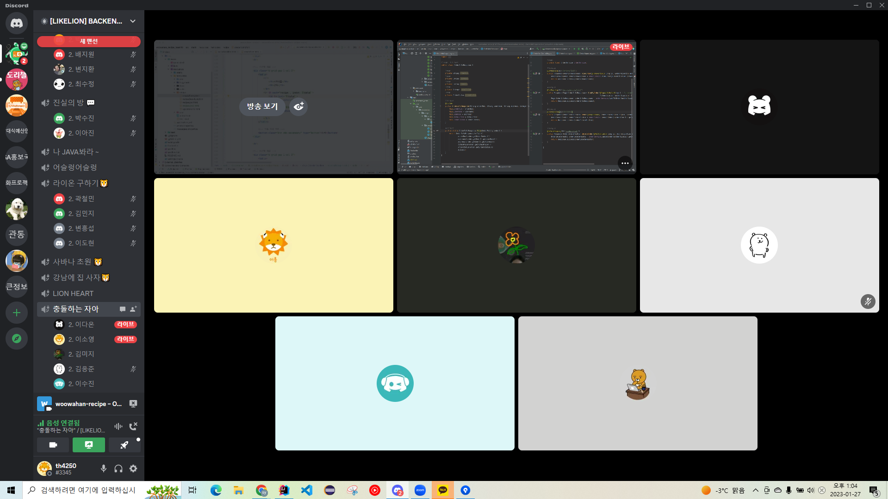

# Woowahan Recipe / 10팀 진행 상황 공유

## 👨‍👦‍👦팀 구성원, 개인 별 역할

### 개발 역할 분담

- 허진혁 (PM) : 타임리프 헤더, 푸터와 같은 공통 layout, 회원가입 및 로그인 ui
- 김응준 (CTO) : 레시피 관련 기능 개발
- 이소영 (Infra) : 판매자 관련 기능, 장바구니 기능, 장바구니 UI 제작, SSL 및 UFW 적용
- 이다온 (기획) : 마이페이지 조회, 수정 기능 및 레시피 관련 UI 제작
- 김미지 (개발) : 댓글 관련 기능 개발, 주문과 배달 페이지 UI
- 이수진 (개발) : 상품 관련 기능 및 ui 개발

 

## 🔊팀 내부 회의 진행 회차 및 일자

------

- 1회 차(2023.01.21 ~ 2023.01.24) Team Notion 페이지를 활용한 진행 상황 공유
- 2회 차(2023.01.25) Discord 회의 진행 & 개발 진행
- 3회 차(2023.01.26) Discord 회의 진행 & 개발 진행
- 4회 차(2023.01.27) Discord 회의 진행 & 개발 진행

 

## 💻현재까지 개발 과정 요약

------

- 허진혁
  - 타임리프를 활용해서 화면 헤더 및 푸터를 만들어 공통 레이아웃을 팀원들이 활용할 수 있게 되었습니다.
  - 입력을 받을 때 유효성 검사를 통해 1차 확인을 하고, 화면상으로 입력칸을 빨갛게 만들어 에러메세지를 전달합니다.
  - 주문 상태와 상품 이름에 따른 검색 기능을 동적 쿼리를 만들었습니다.
  - 회원 정보 수정과 관련하여 회원에 대한 정보를 가져오는 방법(세션, 토큰)을 찾아보고 있습니다.
- 김응준
  - 타임리프 기본 기능을 익힐 수 있었고, 필요한 기능을 만들 수 있게 되었습니다. 레시피 CRUD 기능을 구현하고 있습니다. 대부분 구현했고, 레시피 검색, 리뷰 및 재료와 연관된 부분은 공부가 더 필요할 것 같습니다.
  - MVC 관계를 어떻게 구성해야 하는지, 어떻게 동작하는지 파악할 수 있었습니다.
  - 다양한 HTML 코드를 읽어보며 어떻게 구성되는지 파악할 수 있었습니다.
  - 프론트엔드의 업무를 이해하는 시간이 되었습니다.
- 이소영
  - 알람 기능을 완료하며 Observer Pattern과 비동기 Test에 대해 고민하는 시간을 가졌습니다.
  - 판매자 또는 장바구니 기능을 구현하면서 ERD 설계와 기능 정의서를 변경하는 일이 발생하였는데, 이 점에서 초기에 설계를 자세히 해 놓아야 한다는 것을 느낄 수 있는 시간이었습니다.
  - 배포와 관련하여 생각보다 많은 것들을 설정해주어야 한다는 것을 처음 알게 되었습니다.
  - 타임리프에 대해 알게 되었고, 이전에 다루어 보았던 axios에 대해 다시 복습하는 시간을 가질 수 있었습니다.
- 이다온
  - 마이페이지 조회, 수정 기능과 레시피 등록, 상세페이지를 구현했습니다.
  - 암호화된 비밀번호를 마이페이지에서 변경하여 다시 암호화를 하는 작업이 복잡한 줄만 알았는데 회원가입 암호화했던 로직과 비슷하였고 다른 곳에도 적용이 쉽게 되는 것을 알 수 있었습니다.
  - Test Code를 작성하는데 ControllerTest와 ServiceTest의 차이를 몰랐었는데 조금이나마 알게 되었고 ControllerTest는 구현을 마쳤지만 ServiceTest는 아직 작성할 정도로 이해를 한 상태는 아니기 때문에 많은 시간을 투자했지만 성과가 나오지 않아서 아쉬웠습니다.
  - 두 명이서 같은 브랜치에서 작업을 하게 되면 어떻게 작업을 해야 되는지 깃 사용에 대해 더 알게 되었습니다.
  - 회원가입과 로그인시 설정해둔 예외는 잘 반환이 되는데 token에 대한 예외 반환 처리가 잘되지 않는 것 같아 그에 맞는 해결방법이 (정확하지는 않지만) 예외를 커스텀 해야 한다고 들었는데 아직 적용은 하지 못해 아쉬웠습니다.
  - Postman으로 해당 기능을 실행해볼 때 예외처리가 안되는 부분은 오류로 출력이 되어야 하는데 인텔리제이 콘솔창에 logging [START][END]만 뜨고 에러가 출력되지 않아서 또 어떠한 부분을 추가를 시켜야 하는 것인가에 대한 고민을 하였지만 아직 해결하지 못한 것이 아쉬웠습니다.
  - 중간 중간 작은 에러들이 발생을 해서 에러 노트에 원인과 해결로 작성해서 마무리 짓고 싶었는데 원인만 알고 어떻게 만지다보니 해결이 된 경우는 제대로 마무리 짓지 못한 것들이 있어 다음엔 조금 더 작은 것에도 신경을 써야 하는 것을 알 수 있었습니다.
- 김미지
  - 테스트 코드를 만들고 패스하는 것을 확인했지만 Talend API Tester로 직접 값을 넣어 테스트를 하니 오류가 발생하는 것을 발견했습니다. 테스트 코드를 좀 더 발전시킬 수 있을 것 같습니다.
  - 주문 페이지와 배달 페이지 UI를 만들며 프론트와 어떤 식으로 데이터를 주고 받는지 배울 수 있었습니다.
  - pull을 하면 작성하고 있던 코드가 변경되는 것에 대한 문제를 겪고 있어 깃에 대해 더 공부해야 겠다고 느꼈습니다.
- 이수진
  - 상품 전체 조회, 상세 조회, 등록, 수정, 삭제 기능을 만들었고, 현재는 ui 를 만들고 있습니다.
  - 프론트엔드와 백엔드가 어떻게 함께 동작하는지 더 잘 이해하게 되었습니다.
  - Controller와 RestController의 각 역할과 차이를 명확히 알게 되었습니다.
  - 엔티티 간의 연관 관계를 결정하는 부분이 어려웠습니다. 아직 이해가 부족한 거 같아 더 공부를 해야할 것 같습니다
  - @NotBlank가 Integer타입에 사용할 수 없다는 사실을 알게 되면서 @NotNull과의 차이점도 알게 되었습니다.

 

## ❓ 개발 과정에서 나왔던 질문 (⬜ 미해결, ✅ 해결완료)

------

✅  (ERD 설계) Cart Table에 수량 컬럼이 존재하는게 맞는지?

​	👉 Cart Table이 아닌 CartItem Table에 수량과 가격이 존재하도록 수정

⬜  배포와 관련하여 SSL, UFW 이외에 더 신경써야 할 부분이 있다면 어떤 것이 있을지?

​	👉 야간 멘토링 시간에 질문 예정

✅  비밀번호는 암호화, 복호화 둘 중에 보안상 암호화만 가능한 것 같은데, 진행하기로 했던 비밀번호 변경은 어떻게 진행하면 좋을까요 ?

​	👉🏼 노션 [help] 메뉴에 질문, 답변 기록되어있음

✅  해당 브랜치를 사용한 후 삭제하지 않고 이슈번호를 rename하고 작업을 시작 했는데 왜 rename 하기 전의 이슈 번호가 작성되어있을까요?

​	👉🏼 Local에서 브랜치 생성 시 잘못된 부분이 있는 것 같음

⬜  장바구니나 좋아요 기능 구현 시 수정이 자주 일어나며 쿼리가 자주 발생하게 되는데 이 부분에서 성능을 개선할 수 있는 방법이 있을지?

​	👉 야간 멘토링 시간에 질문 예정

✅  지금 현재 Controller가 RestController가 되고 화면에 사용하는 Controller는 Controller가 되는 것인가요?

​	👉🏼 Page를 이동하는 Controller를 따로 생성해서 해당 Controller의 Annotation만 `@Controller` 가 되고 나머지는 API 요청에 따른 처리를 해야해서 `@RestController` 가 될 것 같습니다.

 

## 📲개발 결과물 공유

------

- Gitlab Repository URL: https://gitlab.com/th42500/woowahan_recipe_team10.git
- Swagger URL: http://ec2-43-201-26-38.ap-northeast-2.compute.amazonaws.com:8080/swagger-ui/
- EC2 URL: http://ec2-43-201-26-38.ap-northeast-2.compute.amazonaws.com:8080/
- Team Notion URL : https://www.notion.so/23-01-13-23-02-16-12ddd64750ad46a0b1547e64ab6fbf5c

