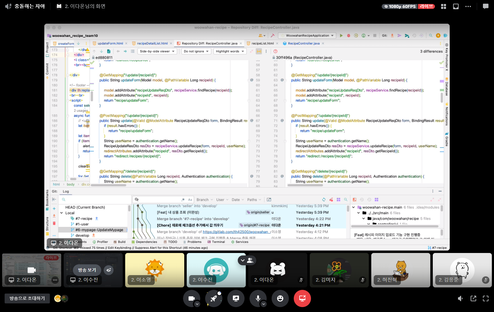

# Woowahan Recipe / 10팀 진행 상황 공유

## 👨‍👦‍👦팀 구성원, 개인 별 역할

### 개발 역할 분담

- 허진혁 (PM) : 장바구니 데이터를 가져온 후 주문 및 결제, 상품 데이터를 가져온 후 주문 및 결제, 진행사 확인
- 김응준 (CTO) : 레시피 View에서 다른 기능 Controller 접근
- 이소영 (Infra) : 장바구니 API 리팩토링, 장바구니 UI 제작, 재료 등록 기능 개선
- 이다온 (기획) : 레시피 재료 장바구니에 담기, 이미지 업로드 기능
- 김미지 (개발) : 판매자 API와 UI
- 이수진 (개발) : 상품 페이지 개선, 이미지 업로드 기능, 바로 구매하기 버튼 구현

 

## 🔊팀 내부 회의 진행 회차 및 일자

- 1회 차(2023.02.06) Discord 회의 및 개발 진행
- 2회 차(2023.02.07) Discord 회의 및 개발 진행
- 3회 차(2023.02.08) Discord 회의 및 개발 진행
- 4회 차(2023.02.09) Discord 회의 및 개발 진행
- 5회 차(2023.02.10) Discord 회의 및 개발 진행

 

## 💻현재까지 개발 과정 요약

------

- 허진혁
  - 웹에서 데이터를 주고받는 방식을 배울 수 있었습니다.
  - Ajax를 활용하여 클라이언트가 서버에 데이터를 어떻게 요청하고, 활용하는지 배울 수 있었습니다.
  - 장바구니에 담긴 상품들을 주문 및 결제를 할 때, 재고에 관한 고민을 해보았습니다.
  - 장바구니를 담당하는 팀원과 상품을 담당하는 팀원과 소통을 하며 주문 및 결제 로직을 만들 때 부족한 사항과 고려해야할 데이터들을 논의하며 수정해 나아갔습니다.
- 김응준
  - HTTP 설계와 Form에 관한 지식을 경험으로 쌓을 수 있었습니다.
  - MVC 패턴을 프로젝트를 통해 경험으로 배울 수 있었습니다.
  - 백엔드 엔지니어가 어떻게 데이터를 가공해서 응답으로 보내줘야 하는지 알 수 있었습니다.
  - 타임리프에 어느정도 익숙해졌고 HTML 작성까진 기본은 할 수 있게 되었습니다.
  - 자바 스크립트에 대한 API통신 지식이 아예 없어서 어려움을 많이 겪고 있습니다.
- 이소영
  - 장바구니 API 개선을 통해 어느 상황에서 `@Controller` / `@RestController` 를 사용하여야 할지 정확하게 알 수 있었습니다.
  - 상품 상세 페이지와 레시피 상세 페이지, 주문자 정보 페이지와의 연결과정을 통해 프론트에서 어떤 정보가 필요하고 서버에서 어떤 정보를 어떤 방법으로 보내주어야 하는지 고민해보는 시간을 가질 수 있었습니다.
  - 장바구니 페이지 제작 시 선택된 checkbox 값에 따라서 해당된 값들만 보내주어야 하는데 `th:each` 를 이용한 각 `<td>` 가 아닌 가장 첫 번째의 `<td>` 에만 적용이 되어 이 부분을 해결하는데 많은 시간을 쏟았습니다.
  - Ajax를 이용한 클라이언트와 서버 통신 과정에서 서버로 JSON이 어떻게 변환되어 데이터가 넘어가는지 알 수 있었습니다.
  - JavaScript를 잘 몰라 효율적인 코드로 구현을 하지 못한 점이 아쉽습니다.
  - 현재 단시간에 많은 페이지 이동 시 로그인이 풀리는 에러가 발생하고 있는데 이로 인해 화면 구현 및 기능 테스트에 어려움이 있습니다.
- 이다온
  - 정보만 받아왔다고 해서 끝나는 것이 아니라 다른 기능들과 연결을 할 수록 부수적인 기능들을 추가하고 신경써야 하는 것들이 많음을 배웠습니다.
  - AWS S3를 통해 이미지 업로드 하는 방법을 배웠습니다.
  - Thymleaf 템플릿이 봐도 봐도 어려웠는데 사용해보면서 form 태그로 어떻게 전송하고 어떤 데이터를 받아와서 통신이 이루어지는지 배울 수 있었습니다.
  - 서버에서 테스트를 하면서 기능 구현을 하고 있는데 로그인이 계속 풀리는 문제와 ec2 서버 연결시 랜덤으로 연결되는 부분 때문에 시간을 많이 잡아 먹어 어려움을 겪고 있고 비로그인시 접근이 안되는 장바구니 페이지를 구현할 때 넘기면서 로그인이 풀려서 된건지 안된건지 여러번 테스트를 해야 알 수 있는 상황에 많은 어려움을 겪었습니다.
  - 레시피 상세조회에서 등록된 재료를 장바구니에 담을 때 구현되어있는 cart dto에 맞춰서 구현해야 해서 이 부분이 많이 어려웠고 재료 1개만 담는 것은 되지만 현재는 이것을 리스트로 보내줘야 하는데 이 부분도 어떻게 해결을 해야 할지 잘 떠오르지 않고 어려움 속에 구글링을 통해 이것저것 시도해보면서 진행하고 있습니다.
  - javaScript를 이용해 구현해야 하는 것들이 구글링을 해서 여러가지 시도에 시간을 많이 쏟은 점이 아쉽습니다.
  - 검색을 해서 데이터를 띄워주는 페이지에서 페이징 처리를 구현했는데 검색결과가 없을시 페이징이 1페이지만 뜨는 것이 아닌 1과 0으로 같이 뜨는 현상을 javaScript로 여러 시도를 하였지만 빠른 시일내에 구현해 내지 못하여 아쉽습니다. 1 페이지만 나오게끔 구현할 예정입니다.
- 김미지
  - 스프링으로 정규식을 적용하는 방법을 배울 수 있었습니다
  - 새로운 기능들과 페이지를 추가하면서 어떤 기능들이 필요한지 다시 생각해보게 되었습니다
  - jwt에서 사용자의 role을 판별하는 것에 어려움을 격으면서 Seller와 User를 다른 entity로 설계하는게 맞는 것인지 ERD에 대해서 고민해보게 되었습니다.
  - 위의 문제에 대한 대안 방법으로 같은 페이지라도 판매자와 사용자 페이지를 서로 분리하도록 했습니다.
- 이수진
  - form 태그 방식과 onclick+js(ajax) 함수를 이용한 방식, 두가지로 html에서 controller로 데이터를 넘겨주는 방법에 대해 알게 되었습니다.
  - 이미지 업로드를 구현할 때, 초과 사이즈일 경우 예외처리를 해줘야한다는 것을 알게되었습니다(미구현)
  - jwt에서 UsernamePasswordAuthenticationToken객체에서 user의 role을 확인하여 권한을 부여해주는데, 저희 프로젝트에서는 user와 seller 두 엔티티를 사용하고 있어서 두 객체의 role을 모두 확인하는 것에 어려움이 있었습니다. 다른 엔티티에 저장되더라도 jwt는 같이 발급해줄 것이라고 생각했는데, 해결방안을 찾지 못해서 아쉽습니다.
  - 위와 같은 경우에 애초에 설계에 문제가 있었던 것인지, role을 확인 하기 이전에 판매자인지 유저인지를 구분할 방법이 있는지, 엔티티를 따로 설계할 경우 어떤식으로 권한을 처리해줄 수 있을지 고민해보고 있습니다.

 

## ❓ 개발 과정에서 나왔던 질문 (⬜ 미해결, ✅ 해결완료)

------

✅ [Ajax에서 Controller로 보낸 값이 제대로 들어오지 않는 오류](https://www.notion.so/Ajax-Controller-c1ec88adf0574512ad5c8718200e0248)

⬜ 로그인 사용자의 엔티티가 두개로 나뉘어져있을 때 토큰에서 어떻게 role을 확인해줄 수 있는지

⬜ UI 상으로 장바구니에 레시피 재료 담는 걸 구현해보려고 시도중인데, 로그인이 계속 풀려서 기능 구현 확인이 어렵습니다.

✅ 로그인과 비로그인의 경우 보여져야 하는 버튼을 다르게 기능 구현 👉🏼 Thymleaf Security 적용

✅ 서버에서 레시피 등록에서 재료 검색이 되지 않아(로컬에서는 검색됨) 확인이 필요함 👉🏼 서버 구동시에는 fetch URL을 서버 URL로 바꿔서 사용, fetch도 절대경로 가능

⬜ 검색결과 없을시 페이징 1 0 나오는 오류

 

## 📲개발 결과물 공유

------

- Gitlab Repository URL: https://gitlab.com/th42500/woowahan_recipe_team10.git
- Swagger URL: http://ec2-43-201-26-38.ap-northeast-2.compute.amazonaws.com:8080/swagger-ui/
- EC2 URL: http://ec2-43-201-26-38.ap-northeast-2.compute.amazonaws.com:8080/
- Team Notion URL : https://www.notion.so/23-01-13-23-02-16-12ddd64750ad46a0b1547e64ab6fbf5c

